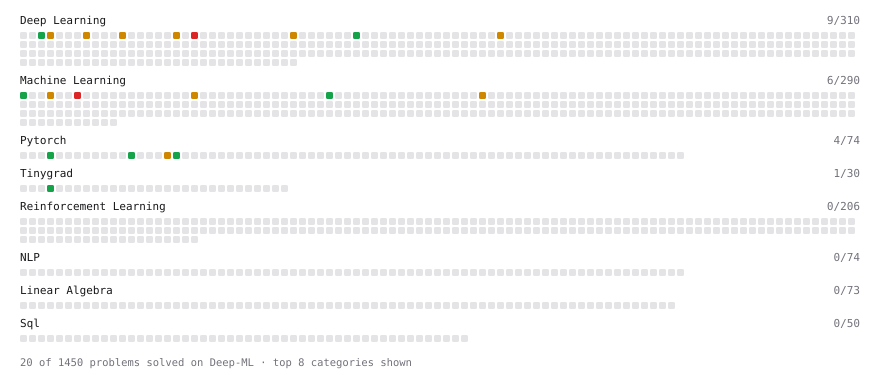

# Deep-ML

My machine learning practice from [Deep-ML](https://www.deep-ml.com). Every solution here was written by hand.

**61** solved · 61 problems · 0 labs · 0 math

[**Browse the interactive portfolio**](https://dongyanl1n.github.io/deep-ml/) to replay this filling in over time.

## Problems

| | Difficulty | Solved | |
| --- | --- | --- | --- |
| [Batch Iterator for Dataset](https://www.deep-ml.com/problems/30) | easy | 2026-09-30 | [solution](problems/0030-batch-iterator-for-dataset) |
| [Binary Classification with Logistic Regression](https://www.deep-ml.com/problems/104) | easy | 2026-07-26 | [solution](problems/0104-binary-classification-with-logistic-regression) |
| [Calculate Accuracy Score](https://www.deep-ml.com/problems/36) | easy | 2026-09-30 | [solution](problems/0036-calculate-accuracy-score) |
| [Calculate Computational Efficiency of MoE](https://www.deep-ml.com/problems/123) | easy | 2026-09-28 | [solution](problems/0123-calculate-computational-efficiency-of-moe) |
| [Calculate Number of Parameters in Neural Network](https://www.deep-ml.com/problems/371) | easy | 2026-09-28 | [solution](problems/0371-calculate-number-of-parameters-in-neural-network) |
| [Compute Multi-class Cross-Entropy Loss](https://www.deep-ml.com/problems/134) | easy | 2026-07-25 | [solution](problems/0134-compute-multi-class-cross-entropy-loss) |
| [Estimate KV-Cache Memory for MHA vs Linear Attention](https://www.deep-ml.com/problems/1019) | easy | 2026-08-19 | [solution](problems/1019-estimate-kv-cache-memory-for-mha-vs-linear-attention) |
| [Feature Scaling Implementation](https://www.deep-ml.com/problems/16) | easy | 2026-09-30 | [solution](problems/0016-feature-scaling-implementation) |
| [Implement 2D Average Pooling](https://www.deep-ml.com/problems/265) | easy | 2026-09-28 | [solution](problems/0265-implement-2d-average-pooling) |
| [Implement a Linear Layer Forward Pass in Tinygrad](https://www.deep-ml.com/problems/892) | easy | 2026-07-22 | [solution](problems/0892-implement-a-linear-layer-forward-pass-in-tinygrad) |
| [Implement a Linear Layer Forward Pass with Matrix Multiplication](https://www.deep-ml.com/problems/883) | easy | 2026-07-22 | [solution](problems/0883-implement-a-linear-layer-forward-pass-with-matrix-multiplication) |
| [Implement a Simple Residual Block with Shortcut Connection](https://www.deep-ml.com/problems/113) | easy | 2026-09-28 | [solution](problems/0113-implement-a-simple-residual-block-with-shortcut-connection) |
| [Implement Binary Cross-Entropy Loss](https://www.deep-ml.com/problems/263) | easy | 2026-09-28 | [solution](problems/0263-implement-binary-cross-entropy-loss) |
| [Implement Dropout from Scratch](https://www.deep-ml.com/problems/901) | easy | 2026-07-28 | [solution](problems/0901-implement-dropout-from-scratch) |
| [Implement Global Average Pooling](https://www.deep-ml.com/problems/114) | easy | 2026-09-28 | [solution](problems/0114-implement-global-average-pooling) |
| [Implement ReLU Activation Function](https://www.deep-ml.com/problems/42) | easy | 2026-09-28 | [solution](problems/0042-implement-relu-activation-function) |
| [Implement Ridge Regression Loss Function](https://www.deep-ml.com/problems/43) | easy | 2026-09-30 | [solution](problems/0043-implement-ridge-regression-loss-function) |
| [Implement RMSNorm (Root Mean Square Layer Normalization)](https://www.deep-ml.com/problems/372) | easy | 2026-09-22 | [solution](problems/0372-implement-rmsnorm-root-mean-square-layer-normalization) |
| [Implement SwiGLU activation function](https://www.deep-ml.com/problems/156) | easy | 2026-09-22 | [solution](problems/0156-implement-swiglu-activation-function) |
| [Implement the ELU Activation Function](https://www.deep-ml.com/problems/97) | easy | 2026-09-28 | [solution](problems/0097-implement-the-elu-activation-function) |
| [Implement the Hard Sigmoid Activation Function](https://www.deep-ml.com/problems/96) | easy | 2026-09-28 | [solution](problems/0096-implement-the-hard-sigmoid-activation-function) |
| [Implementation of Log Softmax Function](https://www.deep-ml.com/problems/39) | easy | 2026-09-28 | [solution](problems/0039-implementation-of-log-softmax-function) |
| [KL Divergence Between Two Normal Distributions](https://www.deep-ml.com/problems/56) | easy | 2026-09-28 | [solution](problems/0056-kl-divergence-between-two-normal-distributions) |
| [Leaky ReLU Activation Function](https://www.deep-ml.com/problems/44) | easy | 2026-09-28 | [solution](problems/0044-leaky-relu-activation-function) |
| [Linear Regression Using Gradient Descent](https://www.deep-ml.com/problems/15) | easy | 2026-09-21 | [solution](problems/0015-linear-regression-using-gradient-descent) |
| [Linear Regression Using Normal Equation](https://www.deep-ml.com/problems/14) | easy | 2026-07-26 | [solution](problems/0014-linear-regression-using-normal-equation) |
| [One-Hot Encoding of Nominal Values](https://www.deep-ml.com/problems/34) | easy | 2026-09-30 | [solution](problems/0034-one-hot-encoding-of-nominal-values) |
| [Random Shuffle of Dataset](https://www.deep-ml.com/problems/29) | easy | 2026-09-30 | [solution](problems/0029-random-shuffle-of-dataset) |
| [Sigmoid Activation Function Understanding](https://www.deep-ml.com/problems/22) | easy | 2026-09-28 | [solution](problems/0022-sigmoid-activation-function-understanding) |
| [Single Neuron](https://www.deep-ml.com/problems/24) | easy | 2026-07-26 | [solution](problems/0024-single-neuron) |
| [Sinusoidal Positional Encoding](https://www.deep-ml.com/problems/906) | easy | 2026-08-02 | [solution](problems/0906-sinusoidal-positional-encoding) |
| [Softmax Activation Function Implementation ](https://www.deep-ml.com/problems/23) | easy | 2026-09-28 | [solution](problems/0023-softmax-activation-function-implementation) |
| [Adam Optimizer](https://www.deep-ml.com/problems/87) | medium | 2026-07-26 | [solution](problems/0087-adam-optimizer) |
| [Block-wise FP8 Quantization](https://www.deep-ml.com/problems/234) | medium | 2026-08-21 | [solution](problems/0234-block-wise-fp8-quantization) |
| [Byte Pair Encoding (BPE) Tokenizer](https://www.deep-ml.com/problems/380) | medium | 2026-08-06 | [solution](problems/0380-byte-pair-encoding-bpe-tokenizer) |
| [Estimate KV Cache Size from Model Config](https://www.deep-ml.com/problems/418) | medium | 2026-09-22 | [solution](problems/0418-estimate-kv-cache-size-from-model-config) |
| [Gaussian Naive Bayes Classifier](https://www.deep-ml.com/problems/261) | medium | 2026-08-03 | [solution](problems/0261-gaussian-naive-bayes-classifier) |
| [Gradient Clipping by Global Norm](https://www.deep-ml.com/problems/197) | medium | 2026-08-25 | [solution](problems/0197-gradient-clipping-by-global-norm) |
| [Implement a Transformer Encoder Block](https://www.deep-ml.com/problems/905) | medium | 2026-08-02 | [solution](problems/0905-implement-a-transformer-encoder-block) |
| [Implement Batch Normalization for BCHW Input](https://www.deep-ml.com/problems/115) | medium | 2026-07-28 | [solution](problems/0115-implement-batch-normalization-for-bchw-input) |
| [Implement Gradient Descent Variants with MSE Loss](https://www.deep-ml.com/problems/47) | medium | 2026-07-26 | [solution](problems/0047-implement-gradient-descent-variants-with-mse-loss) |
| [Implement Group Normalization](https://www.deep-ml.com/problems/126) | medium | 2026-09-22 | [solution](problems/0126-implement-group-normalization) |
| [Implement Grouped Query Attention (GQA)](https://www.deep-ml.com/problems/391) | medium | 2026-08-09 | [solution](problems/0391-implement-grouped-query-attention-gqa) |
| [Implement K-Nearest Neighbors](https://www.deep-ml.com/problems/173) | medium | 2026-07-30 | [solution](problems/0173-implement-k-nearest-neighbors) |
| [Implement Layer Normalization for Sequence Data](https://www.deep-ml.com/problems/109) | medium | 2026-08-09 | [solution](problems/0109-implement-layer-normalization-for-sequence-data) |
| [Implement Masked Self-Attention](https://www.deep-ml.com/problems/107) | medium | 2026-09-22 | [solution](problems/0107-implement-masked-self-attention) |
| [Implement Self-Attention Mechanism](https://www.deep-ml.com/problems/53) | medium | 2026-08-01 | [solution](problems/0053-implement-self-attention-mechanism) |
| [Inference Head Pruning for Transformers](https://www.deep-ml.com/problems/233) | medium | 2026-08-18 | [solution](problems/0233-inference-head-pruning-for-transformers) |
| [Instance Normalization (IN) Implementation](https://www.deep-ml.com/problems/143) | medium | 2026-09-22 | [solution](problems/0143-instance-normalization-in-implementation) |
| [K-Means Clustering](https://www.deep-ml.com/problems/17) | medium | 2026-08-01 | [solution](problems/0017-k-means-clustering) |
| [KV Cache for Efficient Autoregressive Attention](https://www.deep-ml.com/problems/376) | medium | 2026-08-09 | [solution](problems/0376-kv-cache-for-efficient-autoregressive-attention) |
| [Overlapping Max Pooling](https://www.deep-ml.com/problems/190) | medium | 2026-07-29 | [solution](problems/0190-overlapping-max-pooling) |
| [Principal Component Analysis (PCA) Implementation](https://www.deep-ml.com/problems/19) | medium | 2026-08-06 | [solution](problems/0019-principal-component-analysis-pca-implementation) |
| [Rotary Positional Embeddings (RoPE)](https://www.deep-ml.com/problems/381) | medium | 2026-08-07 | [solution](problems/0381-rotary-positional-embeddings-rope) |
| [Simple Convolutional 2D Layer](https://www.deep-ml.com/problems/41) | medium | 2026-07-29 | [solution](problems/0041-simple-convolutional-2d-layer) |
| [Single Neuron with Backpropagation](https://www.deep-ml.com/problems/25) | medium | 2026-07-24 | [solution](problems/0025-single-neuron-with-backpropagation) |
| [Build a Tiny GPT](https://www.deep-ml.com/problems/918) | hard | 2026-08-06 | [solution](problems/0918-build-a-tiny-gpt) |
| [Decision Tree Learning](https://www.deep-ml.com/problems/20) | hard | 2026-08-02 | [solution](problems/0020-decision-tree-learning) |
| [Implement Gated DeltaNet Linear Attention](https://www.deep-ml.com/problems/1017) | hard | 2026-08-19 | [solution](problems/1017-implement-gated-deltanet-linear-attention) |
| [Implement Multi-Head Attention](https://www.deep-ml.com/problems/94) | hard | 2026-08-02 | [solution](problems/0094-implement-multi-head-attention) |
| [Singular Value Decomposition (SVD) of 2x2 Matrix](https://www.deep-ml.com/problems/12) | hard | 2026-09-21 | [solution](problems/0012-singular-value-decomposition-svd-of-2x2-matrix) |

---

_This file is regenerated by Deep-ML on every push._
